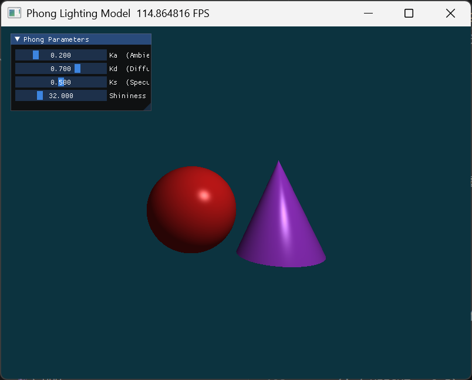
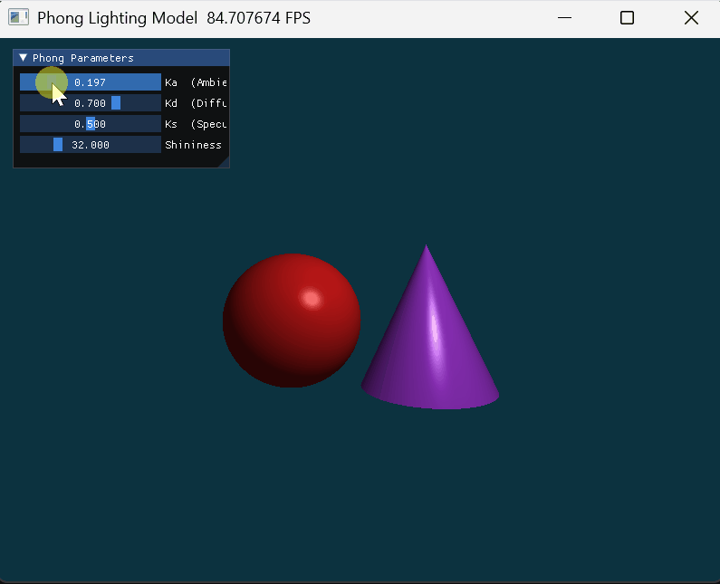
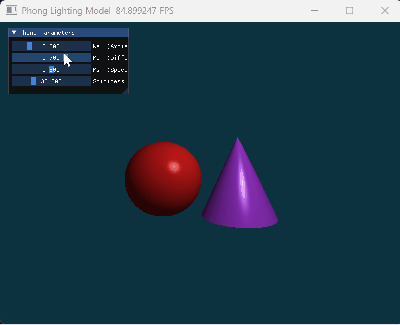
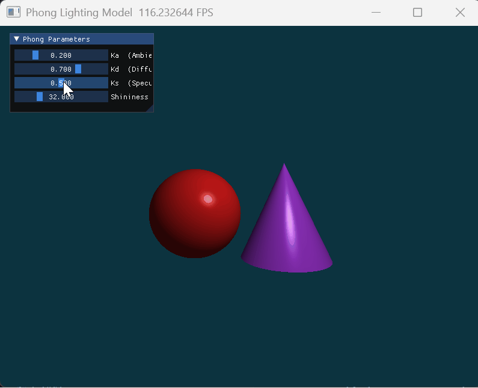
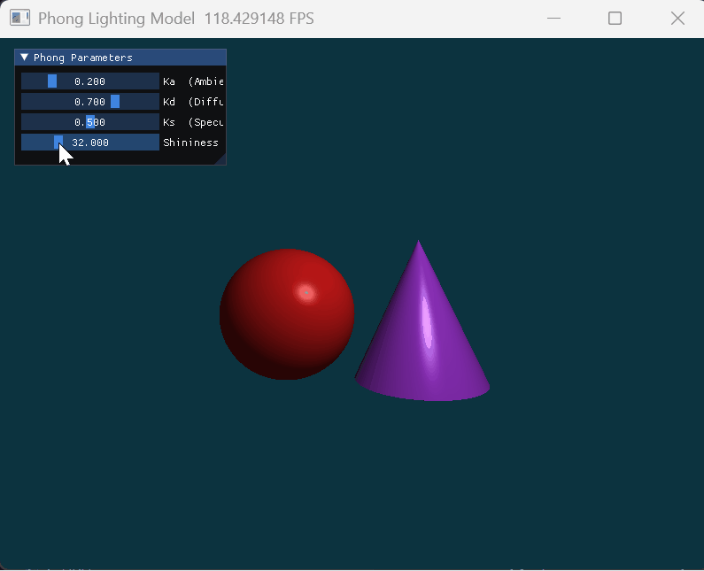
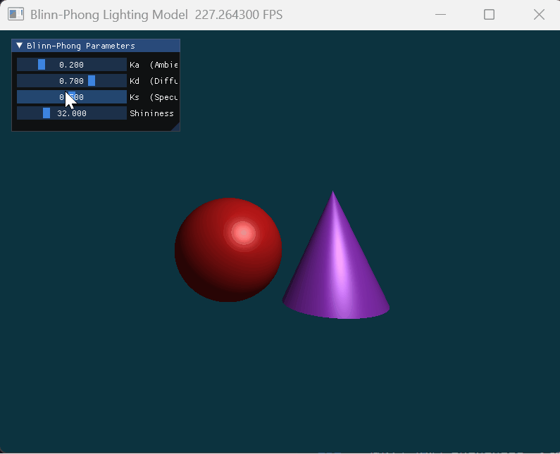
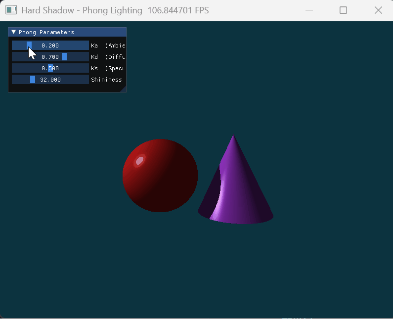

# 计算机图形学实验 Work4

课程：计算机图形学

学生：牟卓雅

学号：202411081034

---
# 一、必做部分
---


## Phong 光照模型

> Computer Graphics Lab Work4
> Phong Lighting Model with Interactive UI using Taichi

---

## 项目简介

本项目基于 **Taichi 图形框架**，通过光线投射（Ray Casting）实现了一个交互式 **Phong 局部光照模型** 渲染器。

程序在二维画布上实时渲染两个几何体——**红色球体**与**紫色圆锥**，并通过 UI 滑动条实时调节材质参数，直观呈现各光照分量对渲染结果的影响。

项目核心目标：

* 理解 Phong 光照模型中环境光、漫反射、镜面高光三个分量的物理含义
* 掌握三维空间向量运算：法向量、光线方向、视线方向与反射向量
* 实现射线与球体、圆锥的解析求交，以及 Z-buffer 深度测试逻辑
* 掌握 Taichi Kernel 中的 GPU 并行像素渲染
* 通过 `ti.ui` 实现材质参数的实时交互调节

---

## 效果展示

### 整体渲染效果



---

### 环境光（Ka）调节


---

### 漫反射（Kd）调节


---

### 镜面高光系数（Ks）调节



---

### 高光指数（Shininess）调节


---

### 控制方式

| 操作 | 功能 |
| --- | --- |
| **Ka 滑动条** | 调节环境光系数（0.0 ~ 1.0，默认 0.2） |
| **Kd 滑动条** | 调节漫反射系数（0.0 ~ 1.0，默认 0.7） |
| **Ks 滑动条** | 调节镜面高光系数（0.0 ~ 1.0，默认 0.5） |
| **Shininess 滑动条** | 调节高光指数（1.0 ~ 128.0，默认 32.0） |

---

## 安装与运行

### 运行环境

推荐环境：

* Python >= 3.10
* Taichi >= 1.7


---

### 运行程序

```bash
python phong_lighting.py
```

---

### 项目结构

```
work4
├── phong_lighting.py
├── README.md
└── figures
    ├── overview.gif
    ├── ka_demo.gif
    ├── kd_demo.gif
    └── ks_shininess_demo.gif
```

---

## 实现

### 核心流程

```
像素坐标 → 生成射线 → 球/圆锥求交 → Z-buffer 深度竞争 → 计算法向量 → Phong 着色 → 写入像素缓冲
```

---

### 1 光线投射

对屏幕每个像素生成一条从摄像机出发的射线，方向由像素的 NDC 坐标决定：

```
u = (i / WIDTH  - 0.5) × 2 × aspect
v = (j / HEIGHT - 0.5) × 2
ray_d = normalize(u, v, -1.0)
```

---

### 2 射线与几何体求交

**球体**：将射线代入球面方程，得到关于 $t$ 的一元二次方程，取最小正根：

$$
|\mathbf{o} + t\mathbf{d} - \mathbf{c}|^2 = r^2
$$

**圆锥**：侧面满足：

$$
(x - a_x)^2 + (z - a_z)^2 = k^2(a_y - y)^2, \quad k = R/H
$$

代入射线方程同样得到二次方程，需额外限制命中点的 $y$ 坐标在 $[y_{base},\, y_{apex}]$ 范围内；底面圆盖单独与 $y = y_{base}$ 平面求交并判断是否在圆内。

---

### 3 Z-buffer 深度测试

对每条射线，分别计算与球体和圆锥的交点参数 $t$，取最小正值作为最终命中对象，保证正确的遮挡关系：

```python
if t_sphere > 0 and (best_t < 0 or t_sphere < best_t):
    best_t, hit_obj = t_sphere, 1
if t_cone > 0 and (best_t < 0 or t_cone < best_t):
    best_t, hit_obj = t_cone, 2
```

---

### 4 Phong 着色模型

在命中点处计算三个光照分量并叠加：

$$
I = I_{ambient} + I_{diffuse} + I_{specular}
$$

$$
I_{ambient}  = K_a \cdot C_{light} \cdot C_{object}
$$

$$
I_{diffuse}  = K_d \cdot \max(0,\, \mathbf{N} \cdot \mathbf{L}) \cdot C_{light} \cdot C_{object}
$$

$$
I_{specular} = K_s \cdot \max(0,\, \mathbf{R} \cdot \mathbf{V})^n \cdot C_{light}
$$

其中 $\mathbf{R} = 2(\mathbf{N} \cdot \mathbf{L})\mathbf{N} - \mathbf{L}$ 为理想反射方向。最终颜色通过 `clamp(color, 0, 1)` 防止过曝。

---

### 5 法向量计算

* **球体**：命中点减去球心后归一化。
* **圆锥侧面**：设命中点到顶点在 XZ 平面的偏移为 $(dx, dz)$，侧面法向量为

$$
\mathbf{n} = \text{normalize}\!\left(\frac{dx}{r},\; k,\; \frac{dz}{r}\right), \quad k = R/H
$$

* **底面圆盖**：固定为 $(0, -1, 0)$。

---

### 6 实时 UI 交互

使用 `ti.ui` 的 `sub_window` + `slider_float` 提供四个滑动条，参数存储在 `ti.field(shape=())` 中，每帧 Kernel 直接读取，无需重新编译，实现零延迟的参数实时更新。

---

## 总结

本实验实现了基于光线投射的 Phong 光照模型交互渲染器，在工程实践中掌握了 GPU 并行着色的基本范式。

通过该项目可以加深对以下内容的理解：

* Phong 光照模型三分量的物理含义与数学推导
* 射线与隐式几何体的解析求交方法
* Z-buffer 深度测试的实现逻辑
* 法向量的正确计算与归一化
* Taichi Kernel 中的实时参数绑定与 UI 交互

---
---

# 二、选做部分

---

## 选做一：Blinn-Phong 模型升级

### 核心改动

在原版 Phong 着色器的基础上，将高光计算中的**反射向量 $\mathbf{R}$** 替换为**半程向量 $\mathbf{H}$**：

$$
\mathbf{H} = \text{normalize}(\mathbf{L} + \mathbf{V})
$$

$$
I_{specular} = K_s \cdot \max(0,\, \mathbf{N} \cdot \mathbf{H})^n \cdot C_{light}
$$

Ka、Kd 的计算与原版完全相同，差异仅体现在 Ks 与 Shininess 上。

---

### 视觉表现差异

在光线以较大角度斜射物体边缘（掠射角）时，两者差异最为明显：

- **Phong**：$\mathbf{R} \cdot \mathbf{V}$ 在掠射角处可能趋近负值，导致高光在边缘**硬截断**，出现明显切边。
- **Blinn-Phong**：$\mathbf{N} \cdot \mathbf{H}$ 在同等条件下始终平滑，高光边缘**柔和过渡**，不会出现突兀的截止线。

此外，相同 Shininess 参数下，Blinn-Phong 的高光亮斑比 Phong **更大更散**；若要两者视觉等效，Blinn-Phong 的 Shininess 约需调至 Phong 的 2～4 倍。

---

### 效果展示



---
---

## 选做二：硬阴影（Hard Shadow）

### 核心改动

在原版 Phong 着色器基础上，每次命中物体后额外发射一条**暗影射线（Shadow Ray）**：

```
命中点 → 向光源方向发射 Shadow Ray → 若中途被遮挡 → 只计算 Ambient
```

若 Shadow Ray 在到达光源之前与任意几何体相交（即存在满足 `1e-4 < t < t_light` 的交点），则判定该点处于阴影中，此时跳过 Diffuse 和 Specular，只保留环境光。

---

### 视觉表现差异

必做部分中两个物体之间**互不影响**，每个点的着色只取决于自身法向量与光源的关系。本版新增了物体间的**互相遮挡**：阴影区域内颜色明显变暗。

为使互投影效果清晰可见，将光源从原来的 `(2, 3, 4)` 调整为 `(-4, 2, 2)`，使光线从左侧横向照射，球体的阴影可以投射到右侧的圆锥上，遮挡关系一目了然。

调节 **Ka** 可以最直观地感受差异——Ka 越低，阴影越黑，边界越锐利；Ka 越高，阴影被环境光填满逐渐消失。

---

### 效果展示



