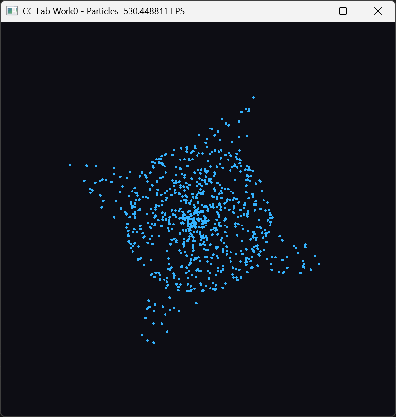
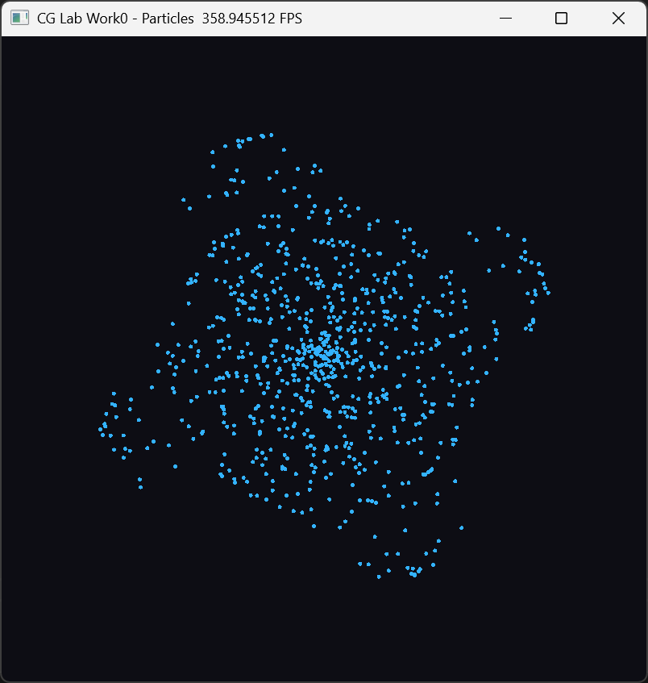
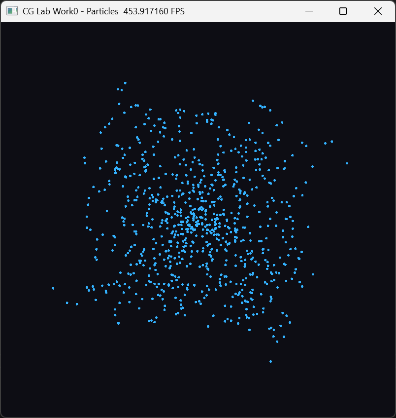
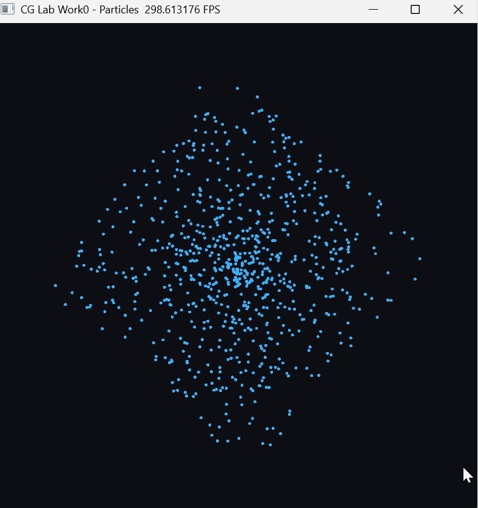
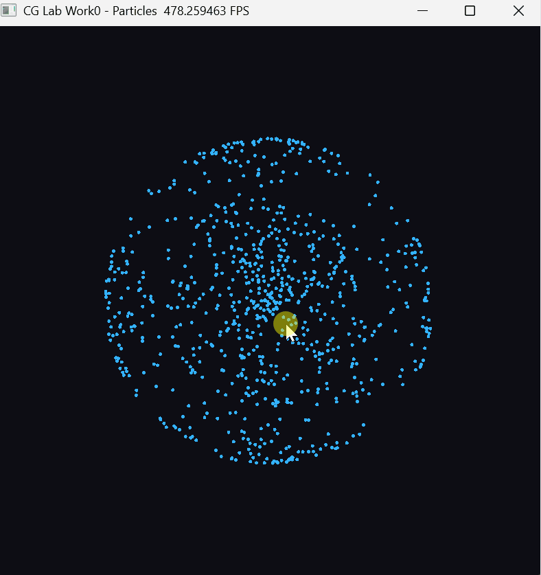
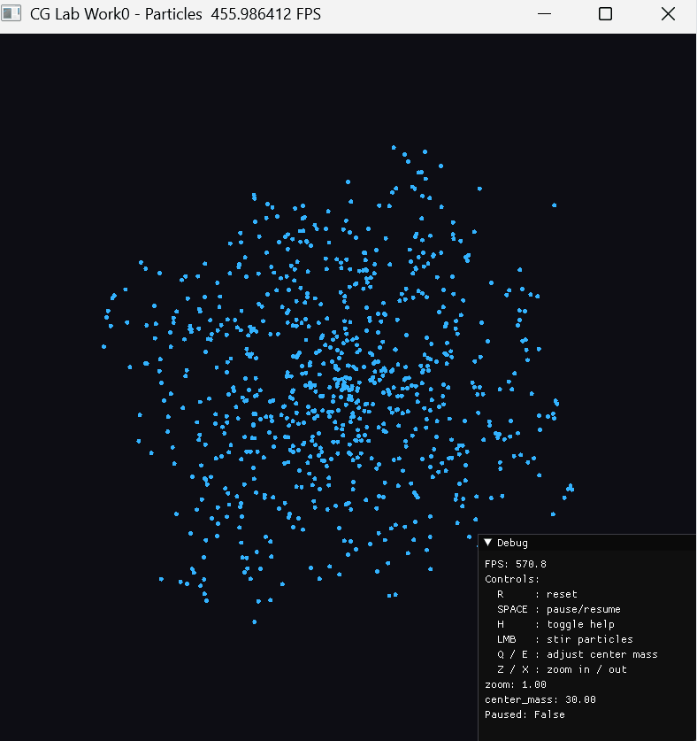

# 计算机图形学实验 Work1

课程：计算机图形学  

学生：牟卓雅  

学号：202411081034  

---

## 基于 Taichi 的二维粒子引力模拟系统

> Computer Graphics Lab Work1
> Particle Gravity Simulation using Taichi

---

# 项目简介

本项目实现了一个 **二维粒子引力模拟系统（Particle Gravity Simulation）**。  
程序使用 **Taichi GPU 计算框架**实现实时物理模拟，并通过图形窗口进行可视化展示。

系统中大量粒子围绕一个中心质量体进行引力运动，并支持多种 **实时交互操作**：

- 鼠标扰动粒子运动
- 调整中心引力强度
- 放大 / 缩小视图
- 暂停 / 重置模拟

该项目展示了计算机图形学中的几个核心概念：

- 粒子系统（Particle System）
- 实时物理模拟
- GPU并行计算
- 交互式可视化

---
---

# 效果展示







---

# 交互功能演示

## 1 控制方式

| 操作 | 功能 |
|-----|-----|
| **R** | 重置粒子系统 |
| **SPACE** | 暂停 / 继续模拟 |
| **H** | 显示 / 隐藏帮助信息 |
| **鼠标左键** | 扰动粒子 |
| **Q / E** | 减小 / 增大中心质量 |
| **Z / X** | 放大 / 缩小视图 |

---

## 2 重置粒子系统（R）

按下 **R 键**可以重新生成粒子，使系统恢复到初始状态。

<!-- 在此处放 reset 操作 GIF -->



---

## 3 鼠标扰动粒子（Mouse Left Button）

按住 **鼠标左键**可以对粒子施加扰动，使粒子运动轨迹发生变化。

<!-- 在此处放 stir 操作 GIF -->



---

## 4 调整中心质量（Q / E）

按 **Q / E 键**可以减小或增大中心质量，从而改变粒子轨道。

- Q：减小中心质量  
- E：增大中心质量  

<!-- 在此处放 mass 调整 GIF -->




---
---

# 安装与运行
## 运行环境

推荐环境：
Python >= 3.10
Taichi >= 1.7


本项目使用 **uv** 管理 Python 依赖。

---

## 安装依赖

```bash
uv sync
```

---

## 运行程序

```bash
cd C:\CG-Lab
uv run -m src.Work1.main
```

运行后将弹出图形窗口，显示粒子模拟。

---

## 项目结构

```
CG-Lab
│
├─ src
│ └─ Work1
│ ├─ main.py
│ ├─ physics.py
| ├─ README.md
│ └─ config.py
│
├─ figures
│ ├─ o1.png
│ ├─ o2.png
│ ├─ o3.png
│ ├─ LMB.gif
│ ├─ QE.gif
│ └─ R.gif
│
├─ pyproject.toml
└─ uv.lock
```

---
---
# 实现
## 核心实现

程序采用 **中心引力模型**进行粒子运动模拟。

每个粒子受到来自中心质量体的引力：
a = (G * M / r³) * r


其中：

- G：引力常数
- M：中心质量
- r：粒子到中心的距离

粒子速度和位置使用 **欧拉积分法（Euler Integration）** 更新：


v = v + a * dt
x = x + v * dt


为了避免粒子距离过近导致数值不稳定，引入 **Softening 参数**：


dist² = r·r + ε²


---

## 技术实现

本项目使用 **Taichi GPU并行计算框架**。

Taichi 可以将 Python 代码自动编译为 GPU kernel，从而实现高性能并行计算。

示例：
```python
@ti.kernel
def step():
for i in range(N):
vel[i] += acc * dt
pos[i] += vel[i] * dt
```

这样每个粒子的计算都可以在 GPU 上 **并行执行**。

---
---
# 总结

本实验实现了一个基于 Taichi 的二维粒子引力模拟系统，通过 GPU 并行计算实现实时物理仿真，并提供多种交互方式用于观察粒子运动行为。

通过该项目可以加深对以下内容的理解：

- 粒子系统模拟
- 实时物理计算
- GPU并行编程
- 图形交互系统
