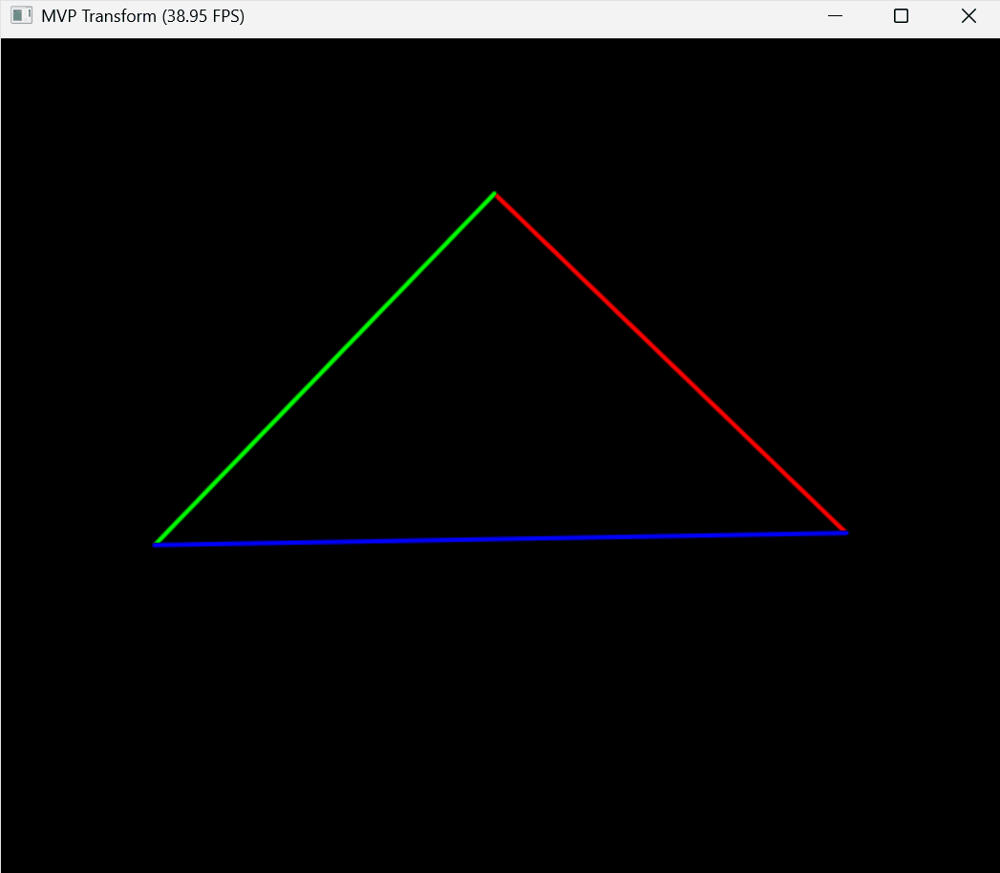

# 计算机图形学实验 Work2

课程：计算机图形学

学生：牟卓雅

学号：202411081034

---

## 基于 Taichi 的 MVP 变换与三角形旋转

> Computer Graphics Lab Work2
> MVP Transformation & Triangle Rotation using Taichi

---

# 项目简介

本项目实现了一个基于 **MVP（Model-View-Projection）变换流程** 的三维图形渲染示例。

程序使用 **Taichi 图形框架**，将三维空间中的三角形顶点通过一系列坐标变换映射到二维屏幕，并实现实时交互。

项目核心目标：

* 理解三维到二维的变换流程
* 实现 Model / View / Projection 三大矩阵
* 掌握透视投影与齐次坐标
* 实现基础图形交互（旋转控制）

---

---

# 效果展示


---

# 交互功能

## 控制方式

| 操作      | 功能       |
| ------- | -------- |
| **A**   | 逆时针旋转三角形 |
| **D**   | 顺时针旋转三角形 |
| **ESC** | 退出程序     |

---

## 旋转演示（A / D）

按下 **A / D 键**可以控制三角形绕 Z 轴旋转。

<!-- 在此处放旋转 GIF -->



---

---

# 安装与运行

## 运行环境

推荐环境：

* Python >= 3.10
* Taichi >= 1.7

---

## 安装依赖

```bash
pip install taichi
```

---

## 运行程序

```bash
cd src/Work2
python main.py
```

运行后将弹出图形窗口，显示三角形，并支持键盘交互。

---

## 项目结构

```
CG-Lab
│
├─ src
│  └─ Work2
│     ├─ main.py
│     ├─ transform.py
│     └─ README.md
│
├─ figures
│  ├─ 2.png
│  └─ AD.gif
```

---

---

# 实现

## 核心实现

本项目实现了计算机图形学中的经典 **MVP 变换流程**：

```
Model → View → Projection → NDC → Screen
```

最终矩阵形式为：

```
MVP = Projection × View × Model
```

---

## 1 模型变换（Model）

对三角形进行绕 Z 轴旋转：

* 控制变量：angle
* 动态更新模型矩阵

---

## 2 视图变换（View）

通过平移变换，将相机移动到原点：

```
world → camera
```

---

## 3 投影变换（Projection）

实现透视投影，主要步骤：

* 构造视锥体（Frustum）
* 透视 → 正交变换
* 正交投影（平移 + 缩放）

---

## 4 透视除法

经过 MVP 变换后，顶点为齐次坐标：

```
(x, y, z, w)
```

需要执行：

```
x /= w
y /= w
z /= w
```

---

## 5 屏幕映射

将标准设备坐标（NDC，范围 [-1,1]）映射到屏幕坐标：

```
x = (x + 1) / 2
y = (y + 1) / 2
```

---

## 技术实现

本项目使用 **Taichi** 进行图形渲染与交互控制。

* 使用 `ti.Matrix` 实现 4×4 矩阵运算
* 使用 `gui.line()` 绘制线框三角形
* 使用 `gui.get_events()` 监听键盘输入

---

---

# 总结

本实验实现了从三维空间到二维屏幕的完整变换流程，并通过交互方式直观展示了模型旋转效果。

通过该项目可以加深对以下内容的理解：

* MVP 变换流程
* 透视投影原理
* 齐次坐标与透视除法
* 基础图形交互实现

---
