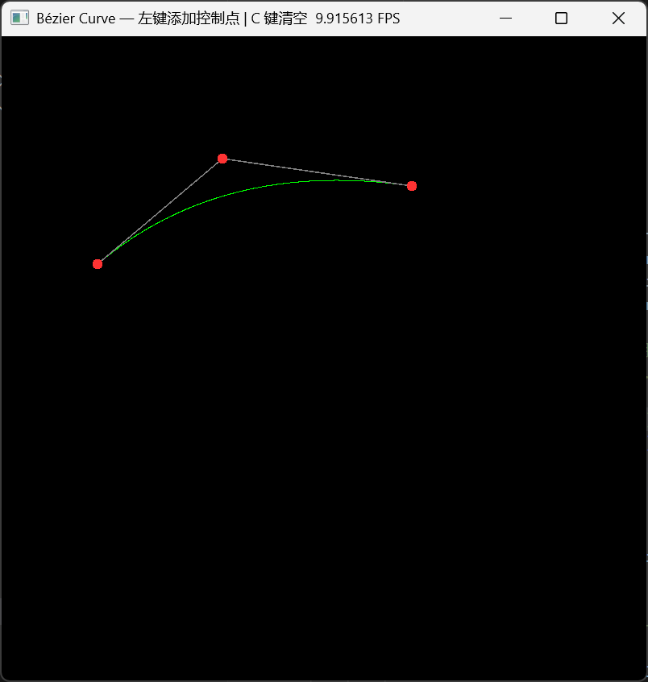
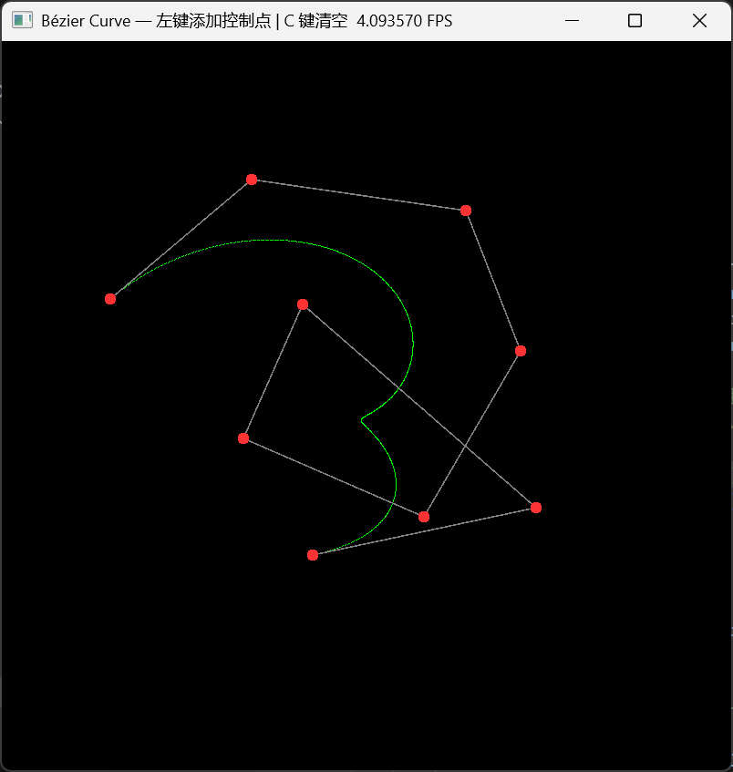
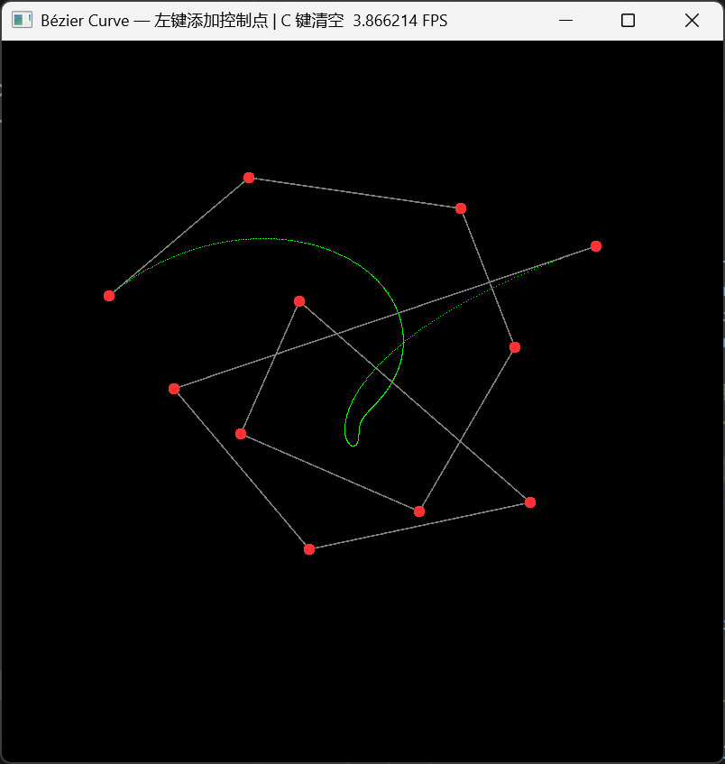
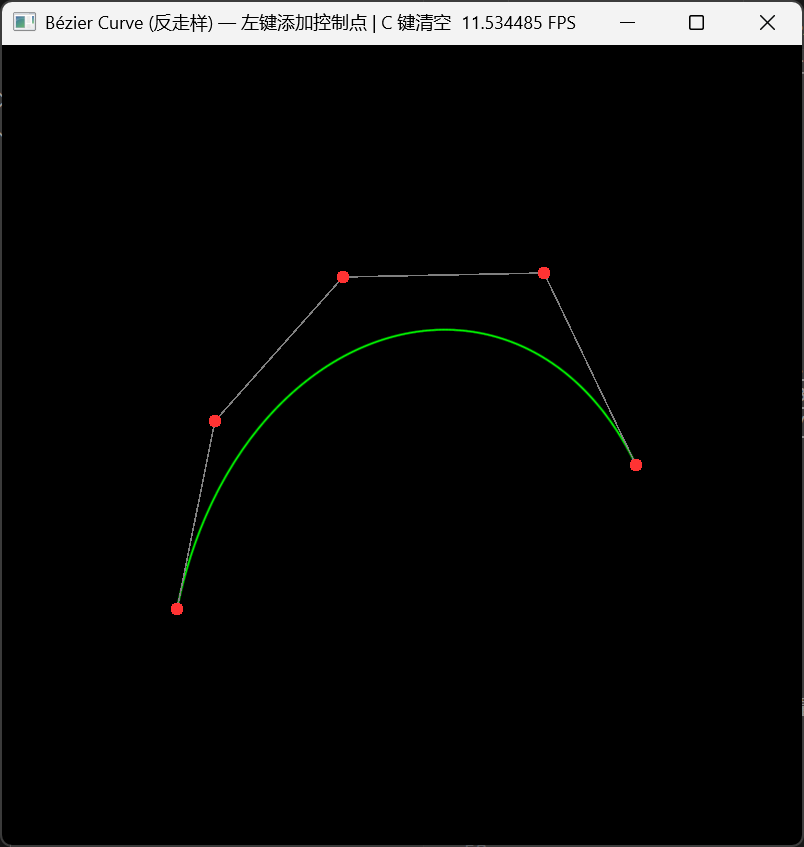
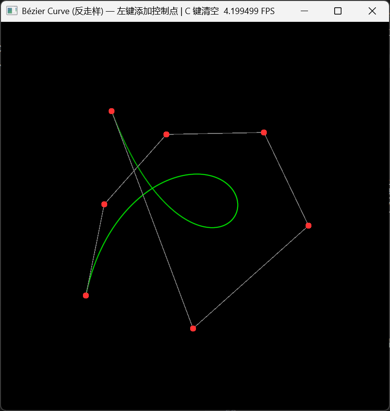
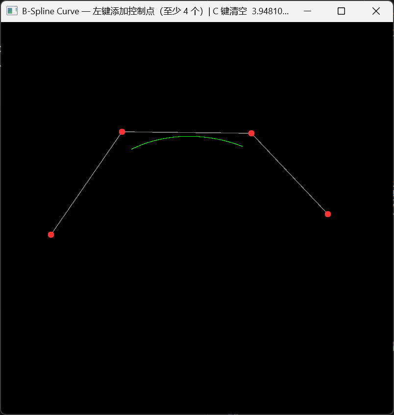
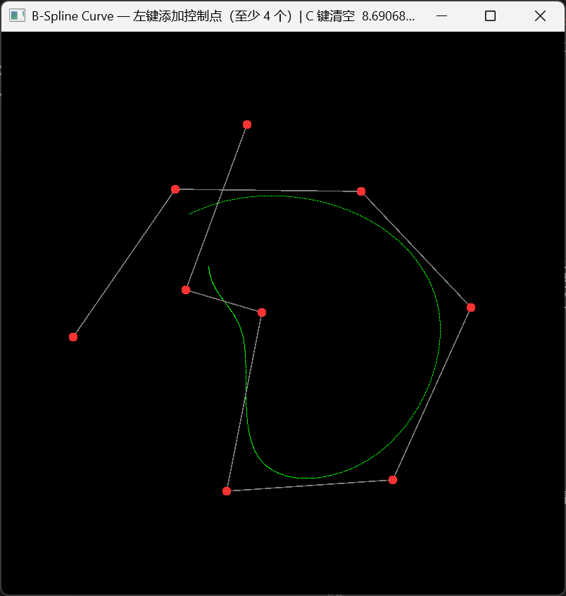

# 计算机图形学实验 Work1

课程：计算机图形学

学生：牟卓雅

学号：202411081034

---
# 一、必做部分
---

### 基于 Taichi 的贝塞尔曲线与 De Casteljau 算法

> Computer Graphics Lab Work3
> Bézier Curve & De Casteljau Algorithm using Taichi

---

## 项目简介

本项目实现了一个基于 **De Casteljau 算法** 的贝塞尔曲线交互绘制程序。

程序使用 **Taichi 图形框架**，在二维画布上通过鼠标点击放置控制点，实时计算并渲染对应的贝塞尔曲线。

项目核心目标：

* 理解贝塞尔曲线的几何意义与控制点关系
* 实现 De Casteljau 递归插值算法
* 掌握光栅化基础：在像素缓冲区中直接操作像素
* 掌握 CPU–GPU 批量数据传输的正确姿势
* 实现基础图形交互（添加控制点、清空画布）

---

---

## 效果展示


  
   
    


---


### 控制方式

| 操作 | 功能 |
| --- | --- |
| **鼠标左键** | 在点击位置添加控制点 |
| **C** | 清空所有控制点，重置画布 |


---

## 安装与运行

### 运行环境

推荐环境：

* Python >= 3.10
* Taichi >= 1.7

---

### 安装依赖

```bash
pip install taichi numpy
```

---

### 运行程序

```bash
python Bezier.py
```


---

### 项目结构

```
CG-Lab
│
├─ src
│  └─ Work1
│     ├─ bezier_curve.py
│     └─ README.md
│
├─ figures
│  ├─ screenshot.png
│  └─ demo.gif
```

---

---

## 实现

### 核心流程

```
鼠标点击 (CPU) → De Casteljau 采样 1001 点 → from_numpy 批量上传 → GPU 并行点亮像素
```

---

### 1 De Casteljau 算法

给定 $n$ 个控制点与参数 $t \in [0,1]$，通过递归线性插值逐层缩减：

$$
P_i^{(r)} = (1-t)\,P_i^{(r-1)} + t\,P_{i+1}^{(r-1)}
$$

每轮将点数减少 1，直到只剩一个点，即为曲线在参数 $t$ 处的坐标。

---

### 2 光栅化

将 De Casteljau 算法输出的归一化浮点坐标映射到屏幕像素：

```
px = int(x × WIDTH)
py = int(y × HEIGHT)
```

随后在 GPU 缓冲区对应位置赋绿色，完成像素点亮。

---

### 3 批量传输（Batching）

在 CPU 将 1001 个采样点全部算好后，通过一次 `from_numpy` 统一上传至 GPU，再由 `@ti.kernel` 并行点亮。

若改为在 Python 循环中逐点写入 GPU 显存，海量 PCIe 跨界通信会导致帧率极低。

---

### 4 对象池技巧

`canvas.circles()` 只接受定长 Taichi Field。

预先分配长度为 100 的数组，多余位置填充为 `-10.0`（超出屏幕范围不可见），真实控制点覆盖到数组前 $k$ 位，从而以固定大小的 Field 绘制数量动态变化的控制点。

---

### 5 连续折线

通过 `indices` 参数显式指定顶点连接顺序 `[0,1, 1,2, 2,3, ...]`，使控制多边形保持连续折线。若不指定，默认两两配对，会出现线段断开的问题。

---

### 技术实现

本项目使用 **Taichi** 进行 GPU 渲染与交互控制。

* 使用 `ti.Vector.field` 管理像素缓冲区与曲线点缓冲区
* 使用 `@ti.kernel` 实现 GPU 并行像素写入
* 使用 `canvas.set_image()` 将像素缓冲区渲染到屏幕
* 使用 `window.get_event()` 与 `window.is_pressed()` 监听键鼠输入

---

---

## 总结

本实验实现了贝塞尔曲线的交互式实时绘制，并在工程实践中掌握了 CPU–GPU 协同的正确模式。

通过该项目可以加深对以下内容的理解：

* De Casteljau 递归插值算法
* 光栅化与像素缓冲区操作
* Batching 与 GPU 并行渲染
* Taichi 图形框架的基础使用

---
---

# 二、选作部分

## 效果展示
### 返走样

  
   

### B样条
 
  

---


### 控制方式

| 操作 | 功能 |
| --- | --- |
| **鼠标左键** | 在点击位置添加控制点 |
| **C** | 清空所有控制点，重置画布 |


---


## 运行程序

```bash
python Bezier_aa.py
```
```bash
python B_spline.py
```