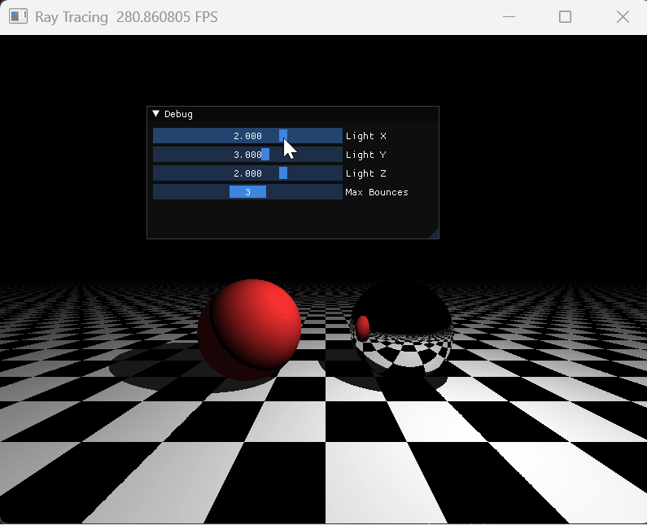
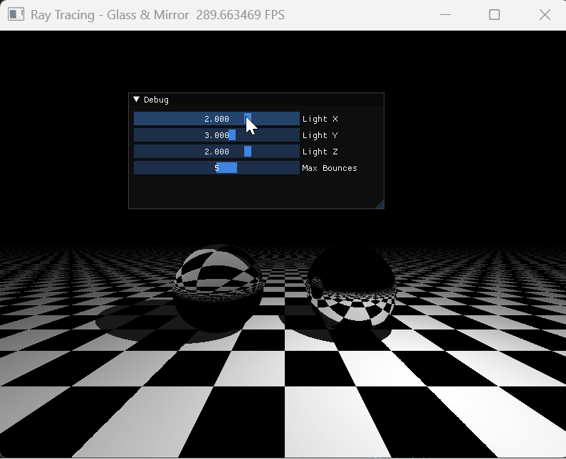

# 计算机图形学实验 Work5

课程：计算机图形学

学生：牟卓雅

学号：202411081034

---

# 一、必做部分

---

## Whitted-Style 光线追踪

> Computer Graphics Lab Work5
> Ray Tracing with Hard Shadows & Mirror Reflection using Taichi

---

## 项目简介

本项目基于 **Taichi 图形框架**，实现了经典的 **Whitted-Style 光线追踪**渲染器。

程序在 800×600 画布上实时渲染包含三个几何体的三维场景——**棋盘格地面**、**红色漫反射球**与**银色镜面球**，通过 UI 滑动条实时调节光源位置与最大弹射次数，直观呈现全局光照效果。

项目核心目标：

* 理解光线投射（Ray Casting）与光线追踪（Ray Tracing）的本质区别
* 掌握通过发射次级射线（Secondary Rays）实现硬阴影与理想镜面反射
* 将传统递归光线追踪算法改写为适合 GPU 并行计算的**迭代（循环）模式**
* 处理浮点精度问题（Shadow Acne），通过法线方向偏移避免自相交

---

## 效果展示

### 整体渲染效果



---

### 控制方式

| 操作 | 功能 |
| --- | --- |
| **Light X 滑动条** | 调节光源 X 坐标（-5 ~ 5，默认 2.0） |
| **Light Y 滑动条** | 调节光源 Y 坐标（0 ~ 5，默认 3.0） |
| **Light Z 滑动条** | 调节光源 Z 坐标（-5 ~ 5，默认 2.0） |
| **Max Bounces 滑动条** | 调节最大弹射次数（1 ~ 5，默认 3） |

---

## 安装与运行

### 运行环境

推荐环境：

* Python >= 3.10
* Taichi >= 1.7

---

### 运行程序

```bash
python Ray_tracing.py
```

---

### 项目结构

```
work5
├── Ray_tracing.py
├── Snell.py
├── MSAA.py
├── README.md
└── figures
```

---

## 实现原理

### 核心流程

```
像素坐标 → 生成主射线 → 场景求交 → 计算法线 → 材质分支
    ├── 漫反射：发射暗影射线 → 光照计算 → 写入颜色 → break
    └── 镜面：更新光线方向 → throughput 衰减 → 继续下一次弹射
```

---

### 1 场景定义

场景中包含三个隐式几何体，通过材质 ID 区分：

* **ID 0 — 地面（无限大平面）**：位于 `y = -1.0`，法线 `(0, 1, 0)`，黑白棋盘格纹理，漫反射材质
* **ID 1 — 红色漫反射球**：圆心 `(-1.5, 0, 0)`，半径 1.0
* **ID 2 — 银色镜面球**：圆心 `(1.5, 0, 0)`，半径 1.0，纯镜面材质

---

### 2 基于迭代的光线弹射

由于 GPU 不擅长递归，每个像素内使用 `for` 循环追踪光线路径：

```python
throughput = vec3(1.0)   # 光线吞吐量（衰减系数）
final_color = vec3(0.0)  # 累积颜色

for bounce in range(5):
    t, hit_id = intersect_scene(ro, rd)
    if hit_id == -1: break
    # 击中镜面 → 更新方向，throughput *= 0.8，continue
    # 击中漫反射 → 计算光照，final_color += throughput * color * diff，break
```

---

### 3 硬阴影

在漫反射着色前，向光源发射**暗影射线（Shadow Ray）**：若在到达光源之前击中其他物体，则判定该点处于阴影中，仅保留环境光分量（`diff = 0.1`）。

---

### 4 Shadow Acne 修复

将暗影射线与反射射线的起点沿法线方向向外偏移极小量，避免射线与自身表面立刻相交：

$$\mathbf{P}_{new} = \mathbf{P} + \mathbf{N} \times \epsilon, \quad \epsilon = 10^{-4}$$

---

### 5 镜面反射

反射向量公式：

$$\mathbf{R} = \mathbf{L}_{in} - 2(\mathbf{L}_{in} \cdot \mathbf{N})\mathbf{N}$$

每次弹射将 `throughput` 乘以反射率（0.8），最终颜色随弹射次数自然衰减。

---

## 总结

本实验实现了基于迭代光线弹射的 Whitted-Style 光线追踪渲染器，掌握了 GPU 并行环境下全局光照效果的实现范式。

通过该项目可以加深对以下内容的理解：

* 光线投射与光线追踪的本质区别
* 次级射线（暗影射线、反射射线）的生成与追踪
* 迭代替代递归的 GPU 编程思维
* Shadow Acne 的成因与修复方法

---
---

# 二、选做部分

---

## 选做一：折射与玻璃材质

### 核心改动

引入**斯涅尔定律（Snell's Law）**，将左侧红球改为**玻璃材质**（折射率 1.5）。

核心逻辑：判断光线从球体外部还是内部射入，对应不同的 `eta`，并在发生全内反射时退化为镜面反射。

---

### 关键实现

**1. 内外判断与法线翻转**

```python
front_face = rd.dot(normal) < 0.0
eta = 1.0 / 1.5    # 外→内
n = normal
if not front_face:
    n = -normal    # 法线翻转，始终朝向入射光线一侧
    eta = 1.5      # 内→外
```

**2. 全内反射判断**

$$\sin^2\theta_t = \eta^2(1 - \cos^2\theta_i)$$

当 $\sin^2\theta_t > 1$ 时发生全内反射，退化为镜面处理。

**3. 折射方向公式**

$$\mathbf{T} = \eta \mathbf{I} + (\eta\cos\theta_i - \cos\theta_t)\mathbf{N}$$

**4. 折射偏移方向**

折射时沿 $-\mathbf{N}$ 偏移（进入介质内侧），与反射的 $+\mathbf{N}$ 方向相反，防止自相交。

---

### 效果展示



---

### 视觉表现

玻璃球可以透过球体看到背后棋盘格地面的折射图像，球体边缘由于掠射角较大会发生全内反射，呈现出类似真实玻璃球的光学效果。

---
---

## 选做二：抗锯齿 MSAA

### 核心改动

在每个像素内**随机采样多次**（发射多条偏移的主射线），将所有采样颜色取平均，实现平滑的边缘过渡。

---

### 实现方式

将单条射线的追踪逻辑提取为独立的 `trace_ray` 函数，在 `render` kernel 中对每个像素循环 `num_samples` 次：

```python
for s in range(16):         # 编译期上限
    if s >= num_samples[None]: break

    ox = ti.random(ti.f32) - 0.5   # 像素内随机抖动 ∈ (-0.5, 0.5)
    oy = ti.random(ti.f32) - 0.5

    u = (i + 0.5 + ox) / W * 2 - 1
    v = (j + 0.5 + oy) / H * 2 - 1

    color_sum += trace_ray(ro, rd, max_bounces[None])

pixels[i, j] = color_sum / float(num_samples[None])
```

每条射线的起点在像素中心附近随机偏移，使得物体边界处不同采样命中不同几何体，平均后颜色自然过渡，消除锯齿。

---

### 效果展示


---

### Samples 数量对比

| 采样数 | 效果 | 帧率影响 |
| --- | --- | --- |
| 1（无 MSAA） | 边缘明显锯齿 | 基准 |
| 4 | 锯齿明显减少 | ~1/4 |
| 8 | 边缘较为平滑 | ~1/8 |
| 16 | 边缘非常平滑 | ~1/16 |

UI 中提供 **MSAA Samples 滑动条**（范围 1 ~ 16），可实时对比有无抗锯齿的视觉差异。

---
