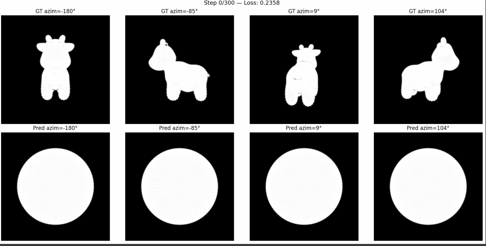

# 计算机图形学实验 Work6

课程：计算机图形学

学生：牟卓雅

学号：202411081034

---

# 必做部分

---

## 可微渲染：球体变奶牛

> Computer Graphics Lab Work6
> Differentiable Rendering with Soft Rasterization & Mesh Regularization using PyTorch3D

---

## 项目简介

本项目基于 **PyTorch3D** 框架，通过**可微光栅化（Differentiable Rasterization）**技术，将一个初始球体网格通过梯度下降逐步优化，使其形状拟合目标奶牛网格的多视角剪影。

核心目标：

* 理解软光栅化（Soft Rasterization）如何通过 Sigmoid 平滑边界，解决硬光栅化的梯度消失问题
* 掌握多视角剪影损失（Silhouette Loss）驱动三维网格优化的完整流程
* 深刻理解拉普拉斯平滑、边长一致性、法线一致性三种正则化对防止网格崩坏的决定性作用
* 通过系统调参，探索各超参数对优化质量的影响

---

## 效果展示

### 基础版结果（fit_mesh.py）



| 参数 | 值 |
|------|-----|
| epochs | 300 |
| lr | 0.01 |
| w_lap | 0.1 |
| w_edge | 1.0 |
| w_normal | 0.01 |
| Total Loss | 0.0046 |
| Silhouette Loss | 0.0009 |

---

### 调参版结果（fit_mesh_tuned.py）


| 参数 | 基础版 | 调参版 | 调整原因 |
|------|--------|--------|----------|
| epochs | 300 | **500** | 迭代更充分，拟合更完整 |
| lr | 0.01 | **0.01→0.005** | 加入学习率衰减，后期精细调整 |
| w_lap | 0.1 | **0.05** | 降低平滑约束，允许牛角耳朵更尖锐 |
| w_edge | 1.0 | **0.5** | 降低边长约束，允许更多形变自由度 |
| w_normal | 0.01 | **0.005** | 降低法线约束，允许更丰富的表面细节 |
| Total Loss | 0.0046 | **0.0032** ✅ |
| Silhouette Loss | 0.0009 | **0.0008** ✅ |

调参后 Total Loss 从 **0.0046 降至 0.0032**，牛角、耳朵等细节更加清晰。

---

## 安装与运行

### 运行环境

* Python 3.10
* PyTorch 2.5.1+cu121
* PyTorch3D 0.7.9
* matplotlib、numpy

推荐在 [ModelScope DSW](https://www.modelscope.cn/my/mynotebook) 云平台运行，已预装 CUDA 环境。

---

### 安装依赖

```bash
pip install --upgrade pip
pip install fvcore iopath matplotlib ninja
pip install "git+https://gitee.com/hongwenzhang/pytorch3d.git" --no-build-isolation
```

---

### 运行程序

将 `cow.obj` 放在代码同目录下，运行：

```bash
# 基础版
python fit_mesh.py

# 调参版
python fit_mesh_tuned.py
```

输出的 `.obj` 文件保存在 `output_meshes/` 目录下，可用 **MeshLab** 查看三维效果。

---

### 项目结构

```
Work6/
├── cow.obj                  # 目标奶牛网格
├── fit_mesh.py              # 基础版优化代码
├── fit_mesh_tuned.py        # 调参版优化代码
├── output_meshes/
│   ├── final_cow.obj        # 基础版输出
│   └── final_cow_tuned.obj  # 调参版输出
├── figures/                 # 结果截图
└── README.md
```

---

## 实现原理

### 核心流程

```
目标奶牛网格
    ↓ 多视角渲染（20个摄像机）
目标剪影（Ground Truth）
    
初始球体网格（ico_sphere level=4）
    ↓ 可微优化循环
    ├── offset_verts(deform_verts) → 形变后网格
    ├── 软光栅化 → 预测剪影
    ├── Silhouette MSE Loss
    ├── + 拉普拉斯平滑 Loss
    ├── + 边长一致性 Loss
    ├── + 法线一致性 Loss
    ↓ Adam 优化器反向传播
最终拟合奶牛形状
```

---

### 1 软光栅化（Soft Rasterization）

传统硬光栅化中，像素要么在三角形内，要么在三角形外，边界处梯度为 0，无法驱动优化。

软光栅化通过像素到三角形边缘的距离 $d$，用 Sigmoid 函数产生平滑的概率过渡：

$$A(d) = \text{sigmoid}\left(\frac{d}{\sigma}\right)$$

其中 $\sigma = 10^{-4}$ 控制边缘模糊程度，使边界处存在非零梯度，引导顶点向正确方向移动。

---

### 2 网格正则化（Mesh Regularization）

仅依靠剪影损失会导致顶点疯狂交叉重叠，变成"刺猬"形状。引入三种正则化：

**拉普拉斯平滑**：约束每个顶点与其邻居的均值偏差，防止尖锐突起

**边长一致性**：惩罚过长或过短的边，防止三角形严重拉伸

**法线一致性**：约束相邻面法线方向接近，保持表面平滑

总损失函数：

$$L_{total} = L_{silhouette} + w_{lap}L_{lap} + w_{edge}L_{edge} + w_{normal}L_{normal}$$

---

### 3 调参分析

正则化权重的降低本质上是在**拟合精度**和**网格质量**之间取得更好的平衡：

* `w_lap` 降低 → 允许更尖锐的局部特征（牛角、耳朵）
* `w_edge` 降低 → 允许更大的形变自由度
* `w_normal` 降低 → 允许更丰富的表面凹凸细节
* 学习率衰减 → 前期快速收敛到大致形状，后期精细调整局部细节

---

## 总结

本实验通过可微渲染技术，实现了从球体到奶牛的三维形状优化，掌握了软光栅化解决梯度消失的核心原理，以及正则化在防止网格崩坏中的决定性作用。

通过系统调参，验证了：
* 降低正则化权重可以获得更丰富的细节，但需要谨慎避免网格崩坏
* 增加迭代次数配合学习率衰减能进一步提升拟合质量
* Total Loss 从 0.0046 降至 0.0032，剪影拟合效果显著提升

---
# 选做部分


---

## 联合纹理优化（Shape + Texture Optimization）

> Computer Graphics Lab Work6
> Joint Shape and Texture Optimization using SoftPhongShader

---

## 项目简介

在必做部分仅优化网格形状的基础上，本实验进一步引入 **SoftPhongShader**，同时利用目标模型的 **RGB 图像** 和 **剪影图像** 作为监督信息，对网格顶点位置和顶点颜色进行联合优化。

相比只依赖剪影进行形状拟合，联合纹理优化能够使模型在恢复几何结构的同时学习目标物体的颜色信息，从而获得更加真实的重建结果。

---

## 实现原理

### 核心流程

```text
目标奶牛模型
      ↓
渲染目标 RGB 图像与剪影

初始球体
      ↓
顶点形变 + 顶点颜色
      ↓
SoftPhongShader 渲染
      ↓
RGB Loss + Silhouette Loss
      ↓
Mesh Regularization
      ↓
Adam 优化
      ↓
最终带颜色的奶牛模型
```

---

### 1 联合优化

实验将顶点坐标和顶点颜色同时作为可学习参数，在优化过程中不断调整网格形状与颜色，使模型能够同时逼近目标物体的几何结构和外观。

---

### 2 RGB 图像监督

采用 **SoftPhongShader** 对当前网格进行渲染，将得到的 RGB 图像与目标图像计算颜色误差，并结合剪影损失共同指导优化，使模型不仅具有正确的轮廓，还能够学习目标颜色分布。

---

### 3 损失函数

联合优化采用形状损失、颜色损失以及网格正则化共同构成总损失：

$$
L=L_{silhouette}+L_{rgb}+w_{lap}L_{lap}+w_{edge}L_{edge}+w_{normal}L_{normal}
$$

其中：

* 剪影损失保证整体形状一致；
* RGB 损失提高颜色拟合效果；
* 拉普拉斯平滑、边长一致性和法线一致性用于保持网格质量，避免出现畸变。

---

## 总结

本实验在必做部分的基础上，实现了形状与纹理的联合优化。通过同时利用 RGB 图像和剪影信息进行监督，模型不仅能够完成几何形状的重建，还能够学习目标模型的颜色特征，使最终结果更加完整。

相比仅优化形状的方法，联合纹理优化充分体现了可微渲染在三维重建中的优势，也进一步加深了对 SoftPhongShader、多目标损失以及联合优化思想的理解。
