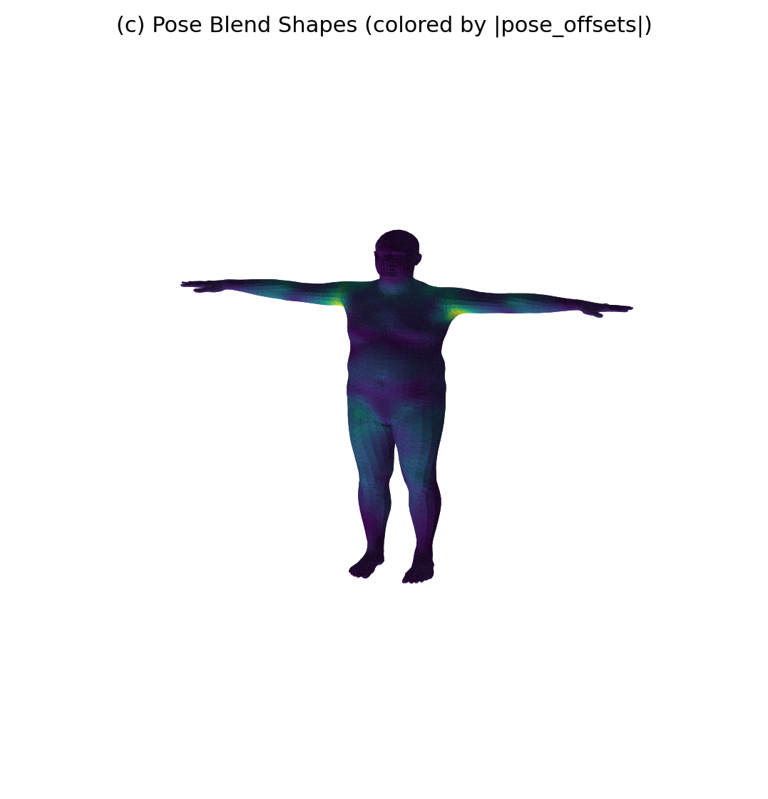
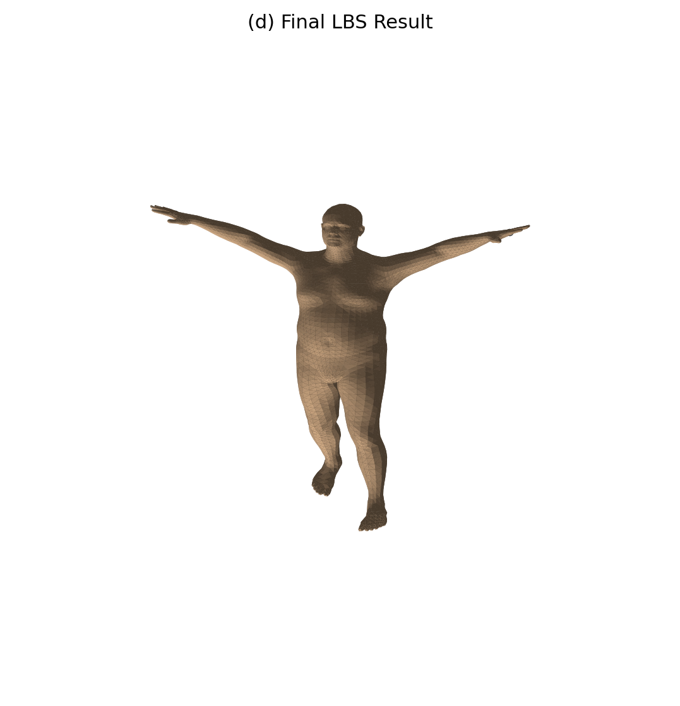
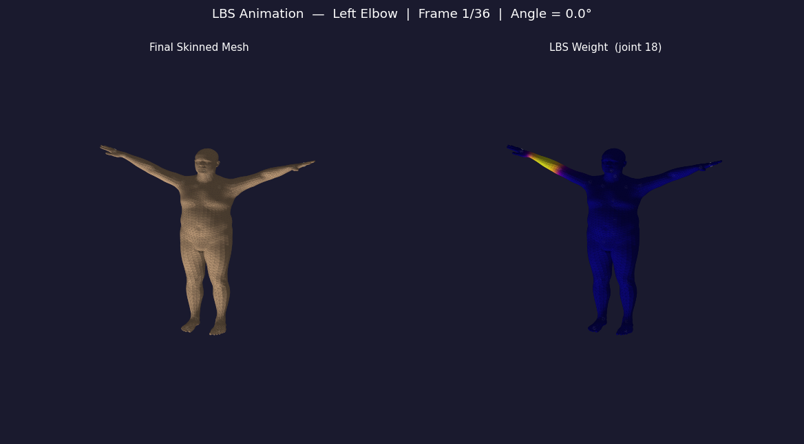
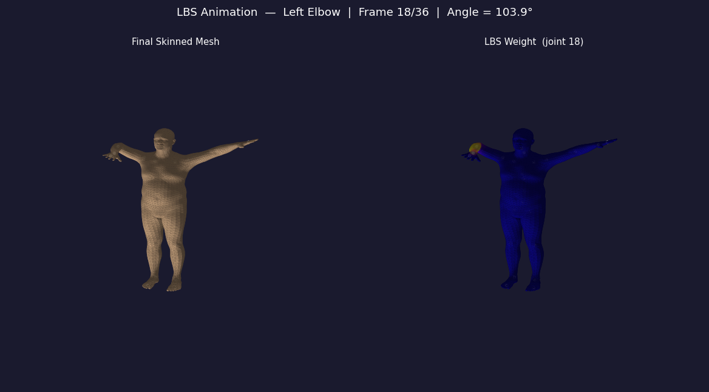
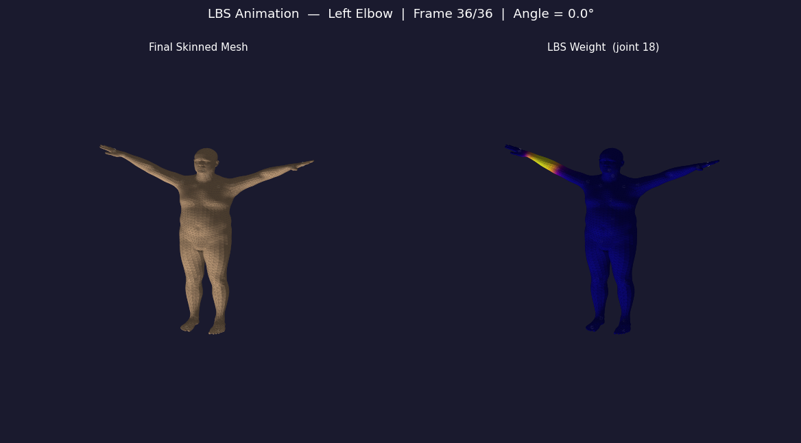

# 计算机图形学实验 Work8

课程：计算机图形学

学生：牟卓雅

学号：202411081034

---

# 一、必做部分

---

## LBS（Linear Blend Skinning）蒙皮

> Computer Graphics Lab Work8
> Linear Blend Skinning Based on SMPL Model

---

## 项目简介

本项目基于 **SMPL 参数化人体模型**，完整实现了 **Linear Blend Skinning（LBS）** 的可视化流程。

实验按照 SMPL 官方实现的计算顺序，依次完成模板网格、形状校正、姿态校正以及线性混合蒙皮四个阶段，并将各阶段的重要中间结果进行可视化。同时，对手写 LBS 与官方前向结果进行了数值一致性验证。

项目核心目标：

* 理解 SMPL 模型中模板网格、形状参数、姿态参数、关节回归以及蒙皮权重之间的关系
* 理解 LBS 四个阶段的计算流程及其作用
* 掌握 SMPL 官方 `lbs()` 的主要计算过程
* 完成手写 LBS 与官方实现的一致性验证

---

## 效果展示

### Stage A：模板网格与蒙皮权重


---

### Stage B：形状校正与关节回归


---

### Stage C：姿态校正（Pose Blend Shapes）



---

### Stage D：最终 LBS 蒙皮结果



---

### 四阶段对比


---

### 全关节权重分布（可选）


---

## 安装与运行

### 运行环境

推荐环境：

* Python 3.10+
* PyTorch
* SMPLX
* NumPy
* Matplotlib
* ImageIO（选做动画）

---

### 运行程序

```bash
python lbs_lab.py --model-dir ./models --out-dir ./outputs --joint-id 18
```

---

### 项目结构

```text
Work8
├── lbs_lab.py
├── lbs_animation.py
├── models
│   └── SMPL_NEUTRAL.pkl
├── outputs
│   ├── stage_a_template_weights.png
│   ├── stage_b_shaped_joints.png
│   ├── stage_c_pose_offsets.png
│   ├── stage_d_lbs_result.png
│   ├── comparison_grid.png
│   ├── all_joint_weights.png
│   └── summary.txt
└── README.md
```

---

## 实现

### 核心流程

```text
Template Mesh
      ↓
Shape Blend
      ↓
Joint Regression
      ↓
Pose Blend Shape
      ↓
Rigid Transform
      ↓
Linear Blend Skinning
      ↓
Final Mesh
```

---

### 1. 模板网格与蒙皮权重

加载 SMPL 模型后，获取模板网格 `v_template` 与顶点对应的 `lbs_weights`，选择指定关节生成权重热力图，同时支持输出全关节主导权重分布图。

---

### 2. 形状校正与关节回归

设置非零 Shape 参数，对模板网格进行形状修正得到 `v_shaped`，随后利用关节回归器计算人体关节位置，实现不同体型下关节位置的自动调整。

---

### 3. 姿态校正

将姿态参数转换为旋转矩阵，计算 Pose Blend Shape，对人体弯曲区域进行几何修正，得到姿态校正后的网格 `v_posed`，并将修正量大小可视化。

---

### 4. Linear Blend Skinning

根据运动学树计算各关节刚体变换，并结合蒙皮权重完成线性混合蒙皮，得到最终人体模型 `verts`，实现自然平滑的关节运动效果。

---

### 5. 手写 LBS 一致性验证

实验最后将手写实现得到的顶点结果与 SMPL 官方前向计算结果进行逐顶点比较，并计算平均绝对误差与最大绝对误差。

实验结果：

* 顶点数：6890
* 面片数：13776
* 关节数：24
* 平均绝对误差：0.0000000000
* 最大绝对误差：0.0000000000

说明手写实现与官方算法完全一致。

---

## 总结

本实验基于 SMPL 模型完成了 LBS 蒙皮流程的完整实现，并对模板网格、形状校正、姿态校正及最终蒙皮结果进行了可视化展示。

通过本实验，加深了对参数化人体模型及 Linear Blend Skinning 工作流程的理解，同时掌握了关节回归、姿态修正以及蒙皮权重在人体动画中的作用，并成功验证了手写实现与官方实现的一致性。

---

---

# 二、选做部分

---

## 姿态动画

### 实现思路

在固定 Shape 参数的情况下，使左肘关节绕指定轴逐渐旋转，并利用手写 LBS 连续计算每一帧人体姿态，最终导出 GIF 动画，观察人体表面随骨骼运动产生的连续变形过程。

---

### 动画展示


---

### 关键帧展示

#### 起始姿态


---

#### 中间姿态


---

#### 结束姿态



---

## 总结

选做部分通过连续改变人体关节姿态，直观展示了蒙皮权重在人体运动过程中的作用。随着左肘逐渐弯曲，人体网格能够平滑跟随骨骼变化，进一步验证了 LBS 在角色动画中的实际应用效果，同时也加深了对骨骼驱动与蒙皮机制的理解。
